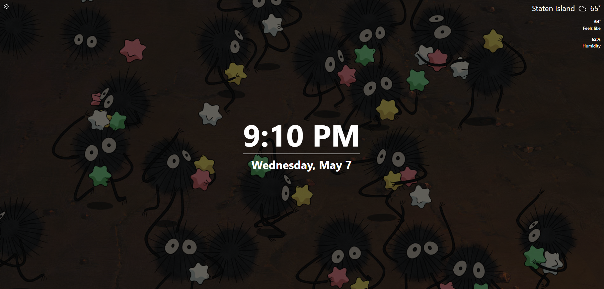

<h1 align="center">Tabliss-Immich</h1>

A beautiful, customisable New Tab page for Firefox and Chrome, with support for using an Immich album as a background image. Fork of <a href="https://github.com/joelshepherd/tabliss">Tabliss</a>

<a href="https://tabliss.io">Tabliss</a> - <a href="https://immich.app/">Immich</a>

## Usage

Install dependencies with `npm install` before running the following scripts.

- `npm run dev[:target]` Local development server
- `npm run build[:target]` Production build
- `npm run translations` Manage translation files

To develop with external services you will additionally need to signup for your own API keys
and enter them into your `.env` file. Get started by copying the example provided `cp .env.example .env`.

## Translations

Checkout the guide to [adding translations](TRANSLATING.md).
